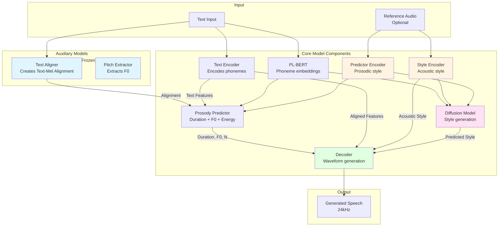
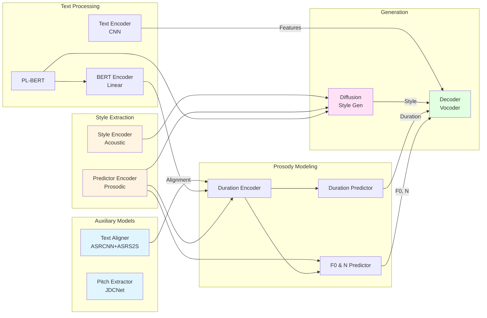
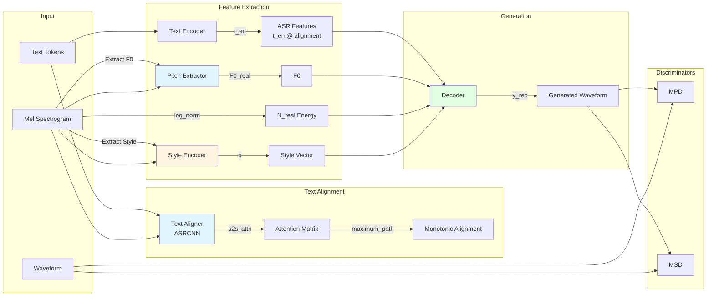
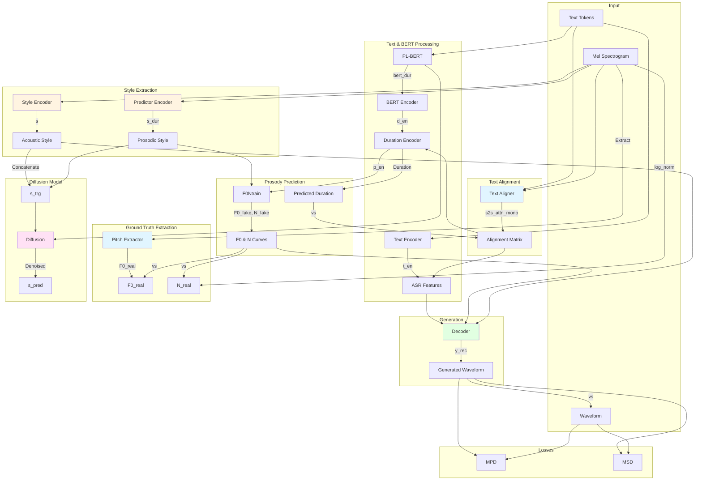
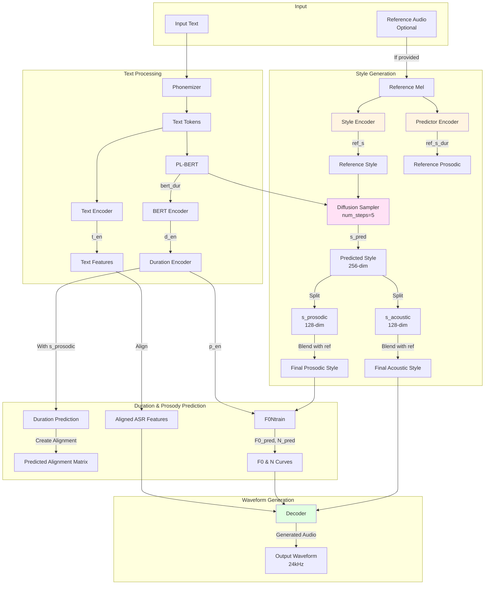
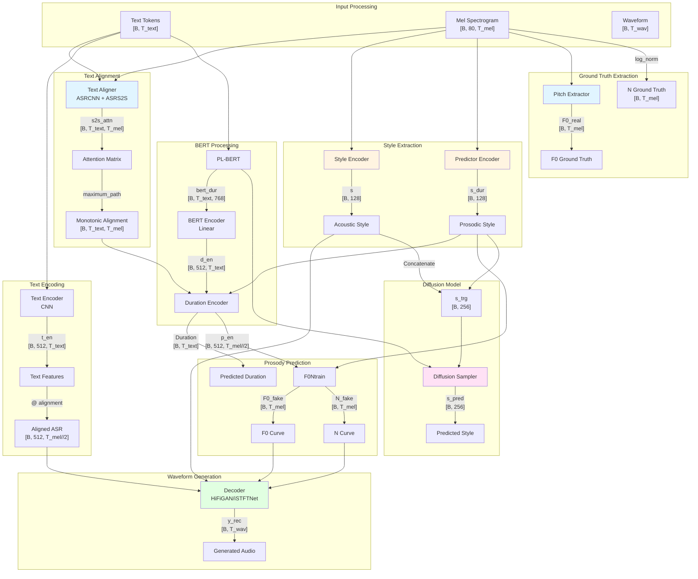

# StyleTTS2 Complete Architecture Diagram

This document contains comprehensive Mermaid diagrams showing how the entire StyleTTS2 repository works, based on the actual code implementation.

## Overview: High-Level Architecture

## Component Interaction Diagram

## Training Stage 1 Flow (train_first.py)

## Training Stage 2 Flow (train_second.py)

## Inference Flow (Based on Demo Notebooks)

## Detailed Data Flow with Tensor Shapes

## Component Details

### Text Aligner (Pre-trained)
- **Location**: `Utils/ASR/models.py`
- **Architecture**: ASRCNN (CNN encoder) + ASRS2S (Attention-based Seq2Seq)
- **Input**: Mel spectrogram + Text tokens
- **Output**: Attention alignment matrix `[batch, text_length, mel_length]`
- **Purpose**: Maps text tokens to mel spectrogram frames
- **Usage**: Creates alignment for duration prediction and text-to-mel alignment

### Pitch Extractor (Pre-trained)
- **Location**: `Utils/JDC/model.py`
- **Architecture**: JDCNet (Joint Detection and Classification Network)
- **Input**: Mel spectrogram `[batch, 1, n_mels, time]`
- **Output**: F0 values per frame `[batch, time]`
- **Purpose**: Extracts fundamental frequency for pitch control
- **Usage**: Provides ground truth F0 during training

### Style Encoders
- **Location**: `models.py:139` (StyleEncoder class)
- **Architecture**: CNN with 4 ResBlk layers + Global Average Pooling
- **Two Types**:
  1. **Style Encoder**: Extracts acoustic style (timbre, voice quality)
  2. **Predictor Encoder**: Extracts prosodic style (F0 patterns, rhythm, duration)
- **Input**: Mel spectrogram `[batch, 1, n_mels, time]`
- **Output**: Style vector `[batch, style_dim]` (typically 128-dim)

### Prosody Predictor
- **Location**: `models.py:440`
- **Components**:
  - **DurationEncoder**: Style-conditioned LSTM for duration prediction
  - **Duration Projection**: Predicts duration per text token
  - **F0Ntrain**: Predicts F0 and energy (N) curves
- **Input**: Text tokens, prosodic style, alignment
- **Output**: Duration, F0 curve, N (energy) curve

### Decoder
- **Location**: `Modules/hifigan.py` or `Modules/istftnet.py`
- **Architecture**: HiFiGAN or iSTFTNet vocoder
- **Input**: 
  - Aligned text features (ASR)
  - F0 curve
  - Energy (N) curve
  - Acoustic style vector
- **Output**: Generated waveform (24kHz)

### Diffusion Model
- **Location**: `Modules/diffusion/`
- **Purpose**: Generates style vectors from text embeddings
- **Input**: BERT embeddings, optional reference style
- **Output**: Predicted style vector (256-dim: 128 acoustic + 128 prosodic)
- **Usage**: Enables style transfer and diverse prosody generation

## Data Flow Summary

1. **Text → Phonemes**: Text is converted to phonemes using phonemizer
2. **Phonemes → Tokens**: Phonemes are tokenized into integer IDs
3. **Text Alignment**: Text aligner creates alignment between text and mel frames
4. **Text Encoding**: Text encoder processes tokens into features
5. **Style Extraction**: Style encoders extract acoustic and prosodic styles
6. **Prosody Prediction**: Prosody predictor generates duration, F0, and energy
7. **Alignment**: Text features are aligned to mel frames using predicted duration
8. **Waveform Generation**: Decoder generates audio from aligned features + F0 + N + style
9. **Discrimination**: Discriminators (MPD, MSD, WavLM) provide adversarial training signals

